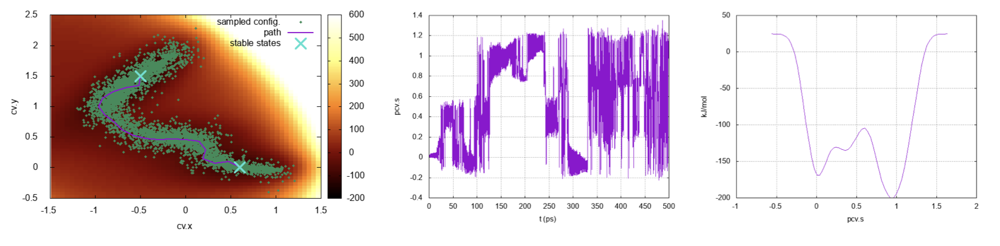

# Plumed masterclass-22-09

Repository of the data for the PLUMED Masterclass 22.9

This Plumed masterclass is on "Using path collective variables to find reaction mechanisms in complex free energy landscapes".

The masterclass consists of 4 parts:
 1. A lecture on Path Collective Variables found on [this youtube video](https://www.youtube.com/watch?v=SAbLcQLGzuk).
 1. A detailed explanation of the material and the exercises on [this plumed website](https://www.plumed.org/doc-master/user-doc/html/masterclass-22-9.html).
 1. The software and data for the handson exercises found on this github repository.
 1. A detailed explanation of the solutions of the exercises on [this youtube video](https://www.youtube.com/watch?v=m5eTgR232V4).
 
Enjoy!
